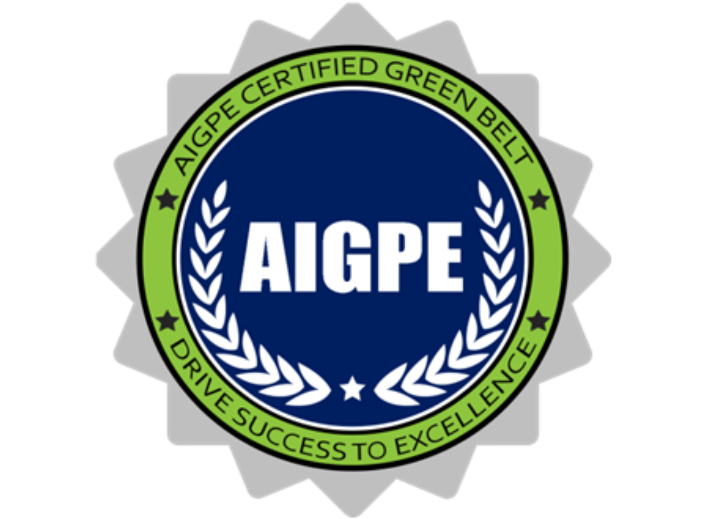
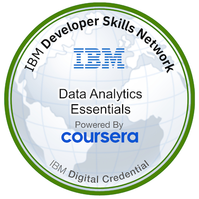
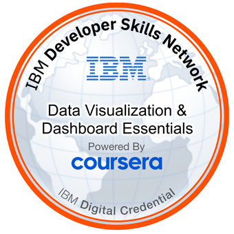
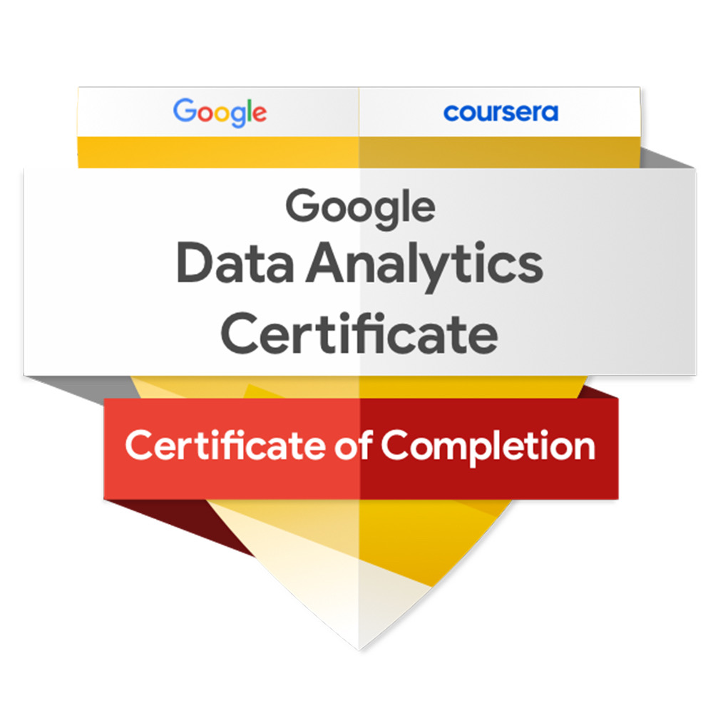

## IT Service Excellence Engineer | Strategic IT Service Delivery | Bridging ITSM & DevOps | Lean Six Sigma

## :unicorn: Summary

**Solution-oriented IT Service Specialist and Lean Six Sigma Green Belt with 13+ years of experience 
bridging the gap between complex infrastructure and business value.** A **T-shaped leader** acting as 
a **technical translator between Agile development cycles and traditional IT Service Management (ITSM) 
frameworks**. 

Known for a **"Steel Filter"** composure—honed in acute psychiatric care—allowing for methodical 
leadership during P1 critical incidents. ‘I don't just manage services; I re-engineer them’. By leveraging 
ELK Stack observability and Generative AI analytics, I transform reactive support desks into proactive, 
automated engines of efficiency. 

## :medal_sports: Certifications

| Certification                                                | Provider                | Year | Description                                                                                                                                                            |
| ------------------------------------------------------------ | ----------------------- | ---- | ---------------------------------------------------------------------------------------------------------------------------------------------------------------------- |
| **Lean Six Sigma Green Belt**                                | AIGPE                   | 2024 | Focus on statistical analysis, process optimization (100+ tools), and methodologies for driving improvement projects at a management level.                            |
| **DevOps and Software Engineering Professional Certificate** | IBM / Coursera          | 2024 | Comprehensive DevOps lifecycle training: CI/CD pipelines, Kubernetes, Docker, OpenShift, Python (Flask), Microservices, DevSecOps, and Test‑Driven Development (TDD). |
| **Data Analytics Professional Certificates**                 | IBM & Google / Coursera | 2024 | Advanced data analysis and visualization with Python, R, SQL, Excel, Tableau/Cognos, plus Generative AI for predictive decision‑making.                               |
| **Project Management Professional Certificate**              | Google / Coursera       | 2024 | Agile and traditional project management: Project initiation, planning, execution, and Agile/Scrum methodologies.                                                      |
| **Cloud Solutions Architect (Professional Prep)**            | AWS / Coursera          | 2025 | Cloud architecture: Scalable solution design, AWS Data Lakes, and Cloud Technical Essentials.                                                                          |
| **IT Support Professional Certificate**                      | Google / Coursera       | 2024 | Infrastructure & security: System administration, network security (Defense against digital dark arts), and OS management.                                             |

## :crossed_swords: Technical Competence and Skills

**Process Automation & Engineering**
- **Automation & Scripting**: Python (Flask, API development), PowerShell, Bash, SQL. 
- **Knowledge-Centered Service (KCS)**: Advanced SOP development, Knowledge-as-Code, and Documentation-as-Automation to drive "Shift-Left" resolution. 
- **Data Engineering & Analytics**: Power BI, Tableau, Snowflake; Mastery of Data Formats (Parquet, YAML, JSON, HCL, TOML) for efficient cloud storage and configuration. 
- **AI/ML & Observability**: Anomaly detection and predictive analytics using ELK Stack, Nexthink, and Grafana to pre-empt system outages and account issues.

**Cloud, DevOps & Infrastructure**
- **Cloud Ecosystems: Azure** (Intune, Entra ID), AWS (Solutions Architect Level), GCP, IBM Cloud. 
- **Containerization & Orchestration**: Kubernetes, Docker, OpenShift, Helm, CI/CD Pipeline 
Architecture. 
- **Core Infrastructure**: VMware, Windows Server, macOS (Jamf), Enterprise Networking (TCP/IP, 
VPN), IT Security.

**Strategic Leadership & Value Delivery**
- **Operational Excellence**: Lean Six Sigma Green Belt (DMAIC), ITIL Expert 
(Incident/Problem/Change/Transition), Root Cause Analysis (RCA). 
- **The "Unicorn" Bridge**: Expert at translating complex technical infrastructure into business value; aligning IT roadmaps with organizational ROI. Or like some would say: "To boldly go where no one else has gone".
- **Cross-Functional Leadership**: Driving collaboration between Dev, Ops, and Stakeholders; experienced in 1:1 coaching, performance management, and talent pipelining. 
- **High-Stakes Crisis Management**: Leveraging high-EQ (honed in psychiatric care) to lead technical bridges during P1/P2 incidents, maintaining calm and methodical resolution. : Systematic pattern recognition and anomaly detection in large datasets to drive data-driven improvement initiatives.

**Soft Skills**
* **Communication**: Clear and effective communication with both technical and non technical stakeholders.
* **Teamwork**: Collaborative and flexible in cross-functional environments.
* **Analysis & Strategy**: Proven creative and analytical thinking when solving complex technical challenges. Strategic thinker with methodical problem-solving skills.
* **Interpersonal**: Empathetic and user-focused; handles difficult situations with professionalism. Understands and respects diverse cultures and demonstrates high emotional intelligence.

## :pushpin: Project Experience & Leadership

:arrow_right:**Focus: Service Transition & Operational Scaling | Saab Enterprise Project**
- **Transition Orchestration**: Spearheaded "Discovery to Go-Live" phases, migrating legacy modules to a modern, RBAC-compliant L1.5 framework. 
- **Rapid Team Scaling**: Engineered the operational foundation to scale the team from 6 to 30 agents in 6 months while maintaining enterprise service quality. 
- **Stakeholder Synergy**: Acted as SPoC between Wipro’s transition engine and Saab’s IT leadership to align roadmaps with organizational governance. 
- **Talent Pipeline**: Designed a technical recruitment framework and conducted interviews to ensure 100% proficiency in Linux, networking, and automation. 
- **Performance Architecture**: Developed real-time visualization suites for FCR, AHT, and CSAT, shifting the desk to data-driven decision-making. 

 

:arrow_right: **Focus: Transition Management, Performance Growth & Competency Development**
* **Service Transition & Migration**: Spearheaded the infrastructure transition phases (Discovery to Go-Live) for large-scale enterprise clients (Saab & Scania), ensuring seamless integration of new service modules into existing environments.
* **Infrastructure Reporting**: Architected automated status dashboards using SQL and visualization tools to track real-time system health and team performance against high-availability KPIs.
* **Continuous Service Improvement (CSI)**: Championed the implementation of automated self-service portals, resulting in a 21% increase in FCR and a significant reduction in ticket volume for the engineering backend.
* **Technical Talent Pipeline**: Designed and executed technical assessment frameworks for recruitment, focusing on Linux proficiency, troubleshooting logic, and automation mindsets to build a high-performing engineering culture.
* **Search Optimization**: Managed the deployment of Elasticsearch clusters to improve data retrieval and log analysis, directly enhancing the team’s ability to perform root cause analysis (RCA).

 

:arrow_right: **Focus: Process Automation & Knowledge Engineering | Agent Enablement & Shift-Left**
- **Internal Solution Portal**: Developed a custom portal for Service Desk agents that automated complex troubleshooting steps, reducing the workload of specialist levels (L2/L3) by 21%. 
- **Security-First Design**: Conducted Capability Gap Analyses and RBAC assessments to ensure resolutions met aerospace-grade security standards. 
- **Knowledge Ecosystem**: Engineered a KCS framework to transition L3 "dark knowledge" into actionable SOPs, increasing frontline resolution capability. 
- **Access Modeling**: Partnered with Identity teams to architect a compliant roadmap for future automated incident resolutions. 

 

:arrow_right: **Observability & Proactive Monitoring | ELK Stack & Nexthink**
- **Log Analytics**: Led ELK Stack (Elasticsearch, Logstash, Kibana) implementation to monitor Windows Event Logs and detect anomalies before user impact. 
- **Proactive Support**: Integrated Nexthink telemetry into ServiceNow, transforming the desk into a proactive "Resolution Engine" via real-time endpoint data. 
- **RCA & Efficiency**: Utilized Pareto/5-Why analysis to identify "ping-pong" tickets, reducing L2 escalations by 28%. 
- **Diagnostic Automation**: Developed PowerShell-based tools to automate initial hardware/software health checks, slashing manual troubleshooting time. 
- **ROI Visibility**: Deployed Executive Dashboards to track MTTR and FCR growth resulting from automation integrations. 

<h3 align="left">Connect with me:</h3>

<h3 align="left">Languages and Tools:</h3>

                               

### Badges
<table style="border-collapse: collapse; width: 100%;">
  <tr>
    <td style="width: 150px; height: 150px;">
      
    </td>
    <td style="width: 150px; height: 150px;">
      
    </td>
    <td style="width: 150px; height: 150px;">
      
    </td>
    <td style="width: 150px; height: 150px;">
      
    </td>
    <td style="width: 150px; height: 150px;">
      
    </td>
    <td style="width: 150px; height: 150px;">
      
    </td>
  </tr>

  <tr>
    <td style="width: 150px; height: 150px;">
      
    </td>
    <td style="width: 150px; height: 150px;">
      
    </td>
    <td style="width: 150px; height: 150px;">
      
    </td>
    <td style="width: 150px; height: 150px;">
      
    </td>
    <td style="width: 150px; height: 150px;">
      
    </td>
    <td style="width: 150px; height: 150px;">
      
    </td>
  </tr>

  <tr>
    <td style="width: 150px; height: 150px;">
      
    </td>
    <td style="width: 150px; height: 150px;">
      
    </td>
    <td style="width: 150px; height: 150px;">
      
    </td>
    <td style="width: 150px; height: 150px;">
      
    </td>
    <td style="width: 150px; height: 150px;"></td>
    <td style="width: 150px; height: 150px;"></td>
  </tr>
</table>

### Some of my Repositories

<table style="border-collapse: collapse; border: 2px solid #00cccc; width: 100%;">
  <tr style="background-color: #008080; color: white; font-weight: bold; border: 2px solid #00cccc;">
    <td style="padding: 8px; border: 1px solid #00cccc;"><b>Name</b></td>
    <td style="padding: 8px; border: 1px solid #00cccc;"><b>Description</b></td>
  </tr>

  <tr style="background-color: #e6ffff;">
    <td style="padding: 8px; border: 1px solid #00cccc; color: #404040;">
      <a href="https://github.com/SnowY4you/devops-capstone-project" style="color:#404040;">devops-capstone-project</a>
    </td>
    <td style="padding: 8px; border: 1px solid #00cccc; color: #404040;">
      This is the last capstone project to complete the IBM DevOps and Software Engineering Professional Certificate.
    </td>
  </tr>

  <tr style="background-color: #cceeff;">
    <td style="padding: 8px; border: 1px solid #00cccc; color: #404040;">
      <a href="https://github.com/SnowY4you/Dashboard_Project" style="color:#404040;">Dashboard_Project</a>
    </td>
    <td style="padding: 8px; border: 1px solid #00cccc; color: #404040;">
      Professional Service Governance dashboard for SLA/KPI monitoring using Plotly Dash.
    </td>
  </tr>

  <tr style="background-color: #e6ffff;">
    <td style="padding: 8px; border: 1px solid #00cccc; color: #404040;">
      <a href="https://github.com/SnowY4you/Job_administration" style="color:#404040;">Job_administration</a>
    </td>
    <td style="padding: 8px; border: 1px solid #00cccc; color: #404040;">
      Tools for managing and automating administrative tasks related to job applications.
    </td>
  </tr>

  <tr style="background-color: #cceeff;">
    <td style="padding: 8px; border: 1px solid #00cccc; color: #404040;">
      <a href="https://github.com/SnowY4you/skolvalarskurs7" style="color:#404040;">skolvalarskurs7</a>
    </td>
    <td style="padding: 8px; border: 1px solid #00cccc; color: #404040;">
      Educational project/resource management for Swedish Grade 7 school selection.
    </td>
  </tr>

  <tr style="background-color: #e6ffff;">
    <td style="padding: 8px; border: 1px solid #00cccc; color: #404040;">
      <a href="https://github.com/SnowY4you/WhatTheCarb" style="color:#404040;">WhatTheCarb</a>
    </td>
    <td style="padding: 8px; border: 1px solid #00cccc; color: #404040;">
      Health-focused application for tracking carbohydrate intake and nutritional data.
    </td>
  </tr>

  <tr style="background-color: #cceeff;">
    <td style="padding: 8px; border: 1px solid #00cccc; color: #404040;">
      <a href="https://github.com/SnowY4you/EventLogWizard" style="color:#404040;">EventLogWizard</a>
    </td>
    <td style="padding: 8px; border: 1px solid #00cccc; color: #404040;">
      Log analysis utility designed to parse and simplify complex system event logs.
    </td>
  </tr>

  <tr style="background-color: #e6ffff;">
    <td style="padding: 8px; border: 1px solid #00cccc; color: #404040;">
      <a href="https://github.com/SnowY4you/CVScreening" style="color:#404040;">CVScreening</a>
    </td>
    <td style="padding: 8px; border: 1px solid #00cccc; color: #404040;">
      Automated screening tool to evaluate CVs against job requirements and keywords.
    </td>
  </tr>

  <tr style="background-color: #cceeff;">
    <td style="padding: 8px; border: 1px solid #00cccc; color: #404040;">
      <a href="https://github.com/SnowY4you/HEIC_converter" style="color:#404040;">HEIC_converter</a>
    </td>
    <td style="padding: 8px; border: 1px solid #00cccc; color: #404040;">
      Python utility for batch converting Apple's HEIC image format to JPEG or PNG.
    </td>
  </tr>

  <tr style="background-color: #e6ffff;">
    <td style="padding: 8px; border: 1px solid #00cccc; color: #404040;">
      <a href="https://github.com/SnowY4you/Merge_PDF" style="color:#404040;">Merge_PDF</a>
    </td>
    <td style="padding: 8px; border: 1px solid #00cccc; color: #404040;">
      A lightweight script to quickly merge multiple PDF documents into a single file.
    </td>
  </tr>

  <tr style="background-color: #cceeff;">
    <td style="padding: 8px; border: 1px solid #00cccc; color: #404040;">
      <a href="https://github.com/SnowY4you/CVScreening" style="color:#404040;">CVScreening</a>
    </td>
    <td style="padding: 8px; border: 1px solid #00cccc; color: #404040;">
      This is a simple CV screener, a very simplified ATS (Applicant Tracking System).
    </td>
  </tr>
</table>
